# StudyBuddy 🧠

> **AI‑powered learning companion that breaks concepts down, answers questions on demand, and curates the best resources for every study session.**


)

[Live Demo](https://studybuddy-lyart.vercel.app/) · [Issue Tracker](https://github.com/rapoluShruti/StudyBuddy-frontend/issues) · [Contribute](#-contributing)


---

## ✨ Key Features

| # | What it does                              | Why it matters                               |
| - | ----------------------------------------- | -------------------------------------------- |
| 1 | **Structured explanations** for any topic | Cuts the fluff so you learn faster           |
| 2 | **Select‑to‑simplify** tricky words/lines | No more switching tabs to Google definitions |
| 3 | **Curated YouTube & article links**       | Learn from sources that respect your time    |
| 4 | **Gemini‑powered Q\&A**                   | Ask, clarify, iterate—instantly              |

---


---

## 🏗️ Tech Stack

* **Frontend:** React (Vite) · TailwindCSS · TanStack Query
* **Backend:** Node.js · Express.js
* **Database:** MongoDB (Mongoose ODM)
* **AI Layer:** **Gemini 2.0 Flash** via `@google/generative-ai` SDK
* **Deployment:** Vercel (frontend) · Render (backend API) · MongoDB Atlas

---

## 🪄 Architecture Overview

```mermaid
flowchart TD
    subgraph Client
        A[React • Vite] --> B[Query Service]
    end
    subgraph API
        B --> C[Express Router]
        C -->|/api/ask| D[AI Controller]
        C -->|/api/resources| E[Resource Controller]
    end
    D -->|Gemini 2.0 Flash| F((Gemini))
    E -->|YouTube Data API| G((YouTube))
    C --> H[(MongoDB)]
```



---

## ⚡ Getting Started

### Prerequisites

* Node >= 18
* npm >= 9 (or pnpm / yarn)
* MongoDB URI (Atlas cluster or local instance)
* **Google GenAI API key** (Gemini)

### 1️⃣ Clone & Install

```bash
git clone https://github.com/rapoluShruti/StudyBuddy-frontend.git
cd studybuddy
npm install              # root monorepo deps
cd packages/server && npm install  # backend deps
cd ../client && npm install       # frontend deps
```

### 2️⃣ Configure Environment Variables

Create a `.env` file in `packages/server`:

```env
MONGODB_URI=mongodb+srv://<username>:<password>@cluster0.mongodb.net/studybuddy
GOOGLE_GENAI_API_KEY=AIza...
PORT=5000
```

### 3️⃣ Run Locally

```bash
# In one terminal:
cd packages/server
npm run dev               # http://localhost:5000

# In another terminal:
cd packages/client
npm run dev               # http://localhost:5173
```

---

## 🧩 API Endpoints (Server)

| Method | Endpoint         | Body                 | Description                      |
| ------ | ---------------- | -------------------- | -------------------------------- |
| `POST` | `/api/ask`       | `{ prompt: string }` | Returns model answer & breakdown |
| `POST` | `/api/resources` | `{ topic: string }`  | Returns curated YouTube/URL list |

> Detailed Swagger docs at `/api-docs` once the server is running.

---

## 🗺️ Roadmap

* [ ] Flash‑card generator
* [ ] Gemini vision diagram explanations
* [ ] Collaborative study rooms (live Q\&A)

Feel free to [open an issue](https://github.com/rapoluShruti/StudyBuddy-frontend/issues) to suggest features or report bugs.

---


---

## 📜 License

Distributed under the **MIT** License. See `LICENSE` for details.

---

## 🙋‍♂️ Author

**Your Name** – [@yourLinkedIn](https://www.linkedin.com/in/shruti-rapolu/) 

---


